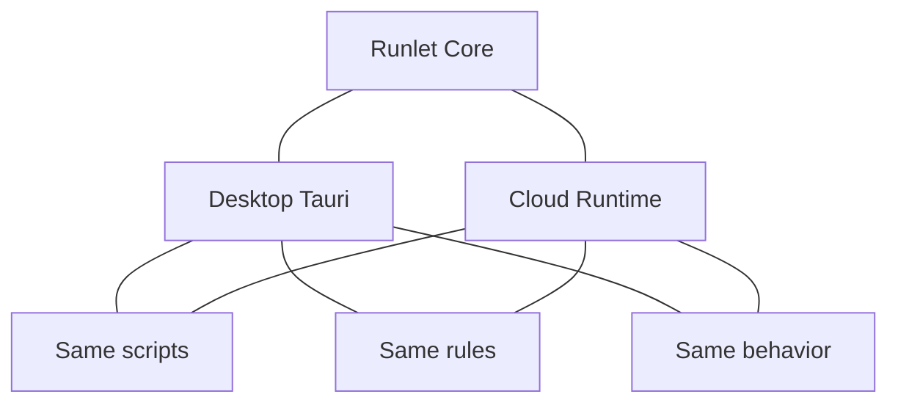

# Runlet + Tauri — The Programmable Application Layer

What you can build by embedding `runlet-core` inside a [Tauri](https://tauri.app) desktop or mobile application.

Runlet lets developers ship applications where **users, teams, or AI systems can safely create logic** — formulas, rules, transformations, workflows, and automations — without giving that logic unrestricted access to the machine.

The application owns the capabilities.
The user owns the logic.

---

# The Core Thesis

Most software eventually needs customization:

- business rules
- workflows
- formulas
- automations
- extensions
- integrations

Today the choices are bad:

- Native plugins are powerful but unsafe.
- `eval` and dynamic code execution expose the application.
- WASM is secure but difficult for non-developers.
- Cloud-only automation creates privacy and latency problems.

Runlet provides a middle layer:

> **A safe programmable layer where users can write logic without becoming application developers.**

The host application decides what is possible.
The sandbox decides what is allowed.

---

# The Core Superpower

A desktop application where:

- the end user writes the logic,
- the application controls permissions,
- execution is isolated,
- results are reproducible,
- side effects require explicit approval.

Runlet provides:

- QuickJS isolation
- capability-based permissions
- memory/time/operation budgets
- deterministic execution profiles
- exact decimal math for financial logic
- controlled effects through `emit`

Unlike raw JavaScript execution, a user script does not receive:

- filesystem access
- arbitrary network access
- credentials
- system APIs
- ambient clock/randomness

unless the application explicitly grants them.

---

# Three Product Categories

## 1. User-Authored Logic

The simplest model:

> Users customize behavior without changing the application.

Examples:

### Spreadsheet and Formula Engine

A spreadsheet where every formula is safe JavaScript.

Benefits:

- no floating-point money errors
- no malicious formulas
- reproducible calculations
- offline execution

Use cases:

- pricing sheets
- forecasting
- payroll calculators
- commission models
- financial planning

---

### Business Rules Engine

Allow customers to define rules without deployments.

Examples:

```javascript
if (customer.region === "EU") {
  return applyTax(customer);
}

if (order.total > 1000) {
  return discount("VIP");
}
```

Applications:

- insurance rules
- lending calculations
- billing logic
- compliance workflows
- approval policies

---

### Local Data Transformation

A local alternative to unsafe scripting tools.

Users can:

- import CSV/JSON
- write transformations
- preview results
- export output

A sandboxed "jq for JavaScript users."

---

# 2. Runlet as the Extension Runtime

The strongest platform opportunity:

> Every Tauri application eventually needs extensions. Runlet can become the safe extension layer.

Instead of shipping native plugins:

```text
Application
     |
Capability API
     |
Runlet Sandbox
     |
User Extensions
```

Developers expose controlled capabilities.

Users install scripts instead of binaries.

---

## Extension Marketplace

Applications can support:

- script packages
- workflow templates
- automation libraries
- community extensions

Examples:

### Accounting App

Users install:

- invoice templates
- tax rules
- reporting scripts

### Project Management App

Users install:

- custom workflows
- automation rules
- integrations

### Data Applications

Users install:

- transformation pipelines
- validation scripts

The extension cannot escape the sandbox.

---

# 3. AI + Runlet

AI creates a new problem:

> Models can generate code and make decisions, but generated code should not receive unrestricted authority.

Runlet becomes the execution boundary.

The model decides:

- what should happen

Runlet decides:

- what is allowed to happen

---

# The AI Safety Pattern

Traditional agent:

```
LLM
 |
Tool access
 |
Side effect
```

Safer architecture:

```
LLM
 |
Generate plan/script
 |
Runlet sandbox
 |
emit(intent)
 |
Human approval
 |
Native action
```

The model never directly controls the machine.

---

# AI Product Ideas

## Local AI Data Analyst

A private local alternative to cloud code execution.

Flow:

1. User imports data.
2. User describes the task.
3. Local model generates a Runlet script.
4. Runlet executes deterministically.

Example:

> "Calculate revenue by region after tax."

The model writes the logic.
Runlet performs the calculation.

Benefits:

- offline
- private
- reproducible
- auditable

---

## Natural Language → Formula

Users describe intent:

> "Add a 15% margin and round to cents."

AI generates:

```javascript
return $(price).multiply("1.15").round(2);
```

Runlet guarantees:

- exact math
- deterministic output
- safe execution

---

## Agentic Workflows With Approval

The script proposes actions:

```javascript
emit("create_invoice", invoice);
emit("send_email", customer);
emit("update_record", change);
```

The host application:

- displays changes
- requests approval
- executes approved actions

Every action becomes:

- inspectable
- replayable
- auditable

---

# Deterministic Execution Profile

The deterministic profile provides:

- no network
- no clock
- no randomness
- reproducible output

Same input:

```
context + script
```

always produces:

```
same output
```

---

## Applications

### Compliance Systems

Reproduce historical calculations:

- insurance quotes
- financial decisions
- billing records

---

### Trading and Simulation

Run strategies against historical data.

Benefits:

- comparable results
- no hidden randomness
- controlled resource usage

---

### Education

Safe coding environments:

- predictable grading
- no cheating through network access
- isolated execution

---

# Capability Model

The full profile allows controlled expansion.

A capability is:

- explicitly granted
- named
- restricted
- host-controlled

The script never receives raw access.

Example:

```
Script
 |
kv.read()
 |
Capability Gate
 |
Application Storage
```

Possible capabilities:

- local database
- application state
- approved APIs
- AI models
- filesystem scopes

---

# Effects Channel: Logic Proposes, Host Decides

Scripts do not directly perform side effects.

They emit intentions.

Example:

```javascript
emit("payment_request", {
  amount: "$500",
});
```

The application decides whether to execute.

This enables:

- approval workflows
- audit logs
- undo/redo
- replay
- compliance history

---

# Same Engine, Multiple Surfaces

The strongest architectural advantage:

The same Runlet logic can execute anywhere.



A company can provide:

- local offline execution
- server execution
- mobile execution

without rewriting business logic.

---

# Mobile Opportunity

Tauri 2 extends the model.

Applications:

- offline field calculators
- inventory systems
- pricing tools
- inspection workflows
- mobile business rules

The same deterministic engine works without connectivity.

---

# Technical Positioning

Runlet should not be positioned as "just JavaScript execution."

The product is:

> A secure runtime for user-authored application logic.

The JavaScript layer is only the authoring language.

The value comes from:

- controlled authority
- deterministic computation
- safe extensibility
- AI-generated code containment

---

# Final Position

Runlet enables a new application model:

> Developers build the application. Users and AI safely program the behavior.

The biggest opportunities:

1. **Extension runtime for Tauri applications**
2. **AI agent safety layer**
3. **Enterprise business rules platform**
4. **Local-first programmable applications**

Runlet is the missing layer between powerful customization and safe execution.
